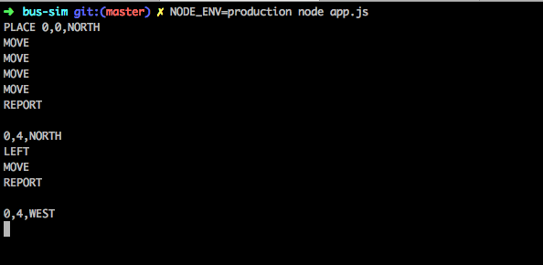

# Bus Sim 2018 🚍

### Get started
Install all the dependencies

`npm i`

To run the tests type

 `npm test`
 
 
### Start the application

from docker hub

`docker run -i musedivision/bus-sim`
 
 
##### build it locally
docker
 `make up`
  
npm `npm run dev`  or  `npm run prod`
 
 
 
🕹START THE SIMULATION:

 
 --