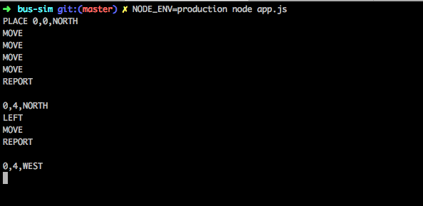

# Bus Sim 2018 🚍

### Get started
Install all the dependencies

`npm i`

To run the tests type

 `npm test`
 
 
### Start the application
 
##### docker

 `make up`
 
 
##### npm
 
 dev `npm dev`
 production `npm prod`
 
 
 
🕹START THE SIMULATION:

 
 --